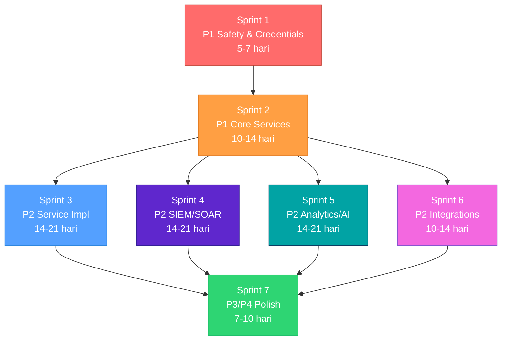

# Gap Closure Work Plan — DCIM Core Platform Program

**Tanggal:** 2026-08-11  
**Basis:** `docs/research/GAP-ANALYSIS.md` (2026-07-28, updated with SIEM/SOAR evidence)  
**Prinsip:** P1 first → P2 → P3 → P4. Setiap task punya acceptance criteria yang verifiable.  
**Constraint:** Solo development, no production access, synthetic-only data, Apache-2.0 license.

---

## Daftar Isi

1. [Ringkasan Gap per Severity](#1-ringkasan-gap-per-severity)
2. [Sprint 1 — P1 Safety & Credential Lockdown](#2-sprint-1--p1-safety--credential-lockdown)
3. [Sprint 2 — P1 Core Services Foundation](#3-sprint-2--p1-core-services-foundation)
4. [Sprint 3 — P2 Service Implementation](#4-sprint-3--p2-service-implementation)
5. [Sprint 4 — P2 SIEM/SOAR Integration](#5-sprint-4--p2-siemsoar-integration)
6. [Sprint 5 — P2 Analytics & AI Hardening](#6-sprint-5--p2-analytics--ai-hardening)
7. [Sprint 6 — P2 External Integrations & Contracts](#7-sprint-6--p2-external-integrations--contracts)
8. [Sprint 7 — P3/P4 Polish & Consistency](#8-sprint-7--p3p4-polish--consistency)
9. [Dependency Graph](#9-dependency-graph)
10. [Completion Checklist](#10-completion-checklist)

---

## 1. Ringkasan Gap per Severity

### P1 — Blokir milestone / safety (22 items)

| Area | Gap IDs | Jumlah | Status |
|---|---|---|---|
| Core Platform | CP-02, CP-06 | 2 | CP-02 ⚠️ remediation open |
| Data Ingestion | DI-10, DI-11 | 2 | ❌ |
| Asset Repository | AR-01, AR-02, AR-05 | 3 | ❌ |
| CMDB | CM-01, CM-02, CM-03 | 3 | ❌ |
| Web Dashboard | DB-01, DB-02, DB-03 | 3 | ❌ |
| Analytics/AI | AI-09 | 1 | ❌ |
| Workflow | WF-05, WF-06, WF-07 | 3 | ❌ |
| External Integrations | EX-01 | 1 | ❌ |
| SOAR | SO-01, SO-02, SO-03 | 3 | ❌ (SO-02 partially closed) |
| Integration Contracts | IC-03 | 1 | ❌ |
| Safety | SS-01, SS-02, SS-03, SS-04, SS-06 | 5 | ❌ |
| Engineering Maturity | EM-01, EM-02, EM-06 | 3 | ❌ |

### P2 — High functional gap (33 items)

| Area | Gap IDs | Jumlah |
|---|---|---|
| Core Platform | CP-07, CP-08, CP-09, CP-10, CP-11, CP-13 | 6 |
| Data Ingestion | DI-02→DI-08 | 7 |
| Asset Repository | AR-03, AR-04 | 2 |
| CMDB | CM-04, CM-05 | 2 |
| Web Dashboard | DB-04 | 1 |
| Analytics/AI | AI-05→AI-08, AI-11→AI-14 | 8 |
| Workflow | WF-01, WF-03, WF-04, WF-08→WF-10 | 6 |
| SOAR | SO-04, SO-05, SO-06 | 3 |
| Integration Contracts | IC-01, IC-05→IC-07 | 4 |
| Safety | SS-05 | 1 |
| Engineering Maturity | EM-03→EM-05 | 3 |

### P3/P4 — Medium/polish (11 items)

CP-14, CP-15, CP-16, DI-01, DI-12, DI-13, DI-14, AI-10, EX-03, EM: misc.

---

## 2. Sprint 1 — P1 Safety & Credential Lockdown

**Durasi:** 5–7 hari  
**Tujuan:** Hilangkan semua safety blockers dan credential exposure.

### Task List

| ID | Task | GAP Ref | Acceptance Criteria | Deliverable |
|---|---|---|---|---|
| S1-01 | **Inventarisasi semua hardcoded credentials** di seluruh repo (`dcim-core-platform`, `SIEM`, `SOAR`, `n8n-workflows`) | SS-01, DI-10 | Daftar lengkap file + line number berisi password/token/key; zero false negatives | `docs/security/credential-inventory.md` |
| S1-02 | **Rotasi dan hapus credentials** dari Git history; pindahkan ke Docker secrets / `.env.example` pattern | SS-01, DI-10, SS-06 | `make public-safety` PASS; `git log --all -p \| grep -i password` returns 0; `.env.example` hanya placeholder | Commits + rotasi evidence |
| S1-03 | **Suspend unsafe n8n workflows** — tambahkan `SUSPENDED` flag dan safety-gate doc pada `systemctl restart` dan decommission workflows | SS-02, SS-03, SS-04, WF-05, WF-06, WF-07 | Workflow JSON di-prefix `SUSPENDED-`; doc `automation-safety-boundary.md` updated; tidak ada write action tanpa approval gate | Updated workflow files + doc |
| S1-04 | **Implementasi dry-run mode** di workflow service | SS-03, WF-06 | `IncidentCase.transition_to(dry_run=True)` default; test coverage ≥80%; no live execution path tanpa explicit `dry_run=False` + approval | `services/workflow/` code + tests |
| S1-05 | **CI/CD untuk repo satelit** (`SIEM`, `SOAR`) — minimal: lint, public-safety scan, JSON validation | EM-01, EM-06 | `.github/workflows/ci.yml` di setiap repo; `make check` equivalent PASS | CI workflow files |
| S1-06 | **Unit tests untuk SOAR workflow** — validasi JSON structure, node connectivity, credential references (no plaintext) | EM-02 | ≥10 tests; 100% pass; coverage: node count, connection integrity, no hardcoded secrets in JSON | `SOAR/tests/test_soar_workflow.py` |
| S1-07 | **Tutup remediation issue #20** dengan scope minimal | CP-02 | Issue #20 acceptance matrix checklist 100% met; `make phase0-check` PASS | PR merged |

### Gate Criteria
```bash
make phase0-check          # Core platform
make public-safety         # All repos — zero credential findings
# Satellite CI workflows green
```

---

## 3. Sprint 2 — P1 Core Services Foundation

**Durasi:** 10–14 hari  
**Dependency:** Sprint 1 complete  
**Tujuan:** Deliver minimal service code untuk semua P1 placeholder gaps.

### Task List

| ID | Task | GAP Ref | Acceptance Criteria | Deliverable |
|---|---|---|---|---|
| S2-01 | **CMDB service — CI data model** PostgreSQL schema: 11 CI types, 7 relationship types | CM-01 | `services/cmdb/src/dcim_cmdb/models.py` dengan Pydantic models; `alembic/` migration script; schema matches ADR-0007 spec | Model code + migration |
| S2-02 | **CMDB service — CRUD API** FastAPI endpoints | CM-02, CM-03 | `POST/GET/PUT/DELETE /api/v1/cmdb/ci/{ci_id}`; topology query endpoint; ≥20 unit tests; `make phase3-test` PASS | API code + tests |
| S2-03 | **Asset Repository — PostgreSQL schema** 4 tables (asset, location, contract, lifecycle) | AR-01 | Pydantic models + Alembic migration; matches `schemas/asset.schema.json` | Model code + migration |
| S2-04 | **Asset Repository — CRUD API + bulk import** | AR-02, AR-05 | `POST/GET/PUT/DELETE /api/v1/assets/{asset_id}`; `POST /api/v1/assets/bulk`; ≥15 unit tests | API code + tests |
| S2-05 | **Web Dashboard — React scaffold** (ADR-0017) | DB-01 | `web/` contains: `package.json`, `vite.config.ts`, `src/App.tsx`, `src/pages/` with 7 stub views; `npm run build` succeeds | React scaffold |
| S2-06 | **Web Dashboard — 7 view stubs** (NOC/SOC/Facilities/CMDB/SLA/Logs/Tasks) | DB-02 | Setiap view punya route + placeholder component + breadcrumb; `/` default ke NOC view | 7 page components |
| S2-07 | **Web Dashboard — API Gateway stub** | DB-03 | `services/api/src/dcim_api/gateway.py` dengan proxy routes ke backend services; RBAC middleware stub | Gateway code |
| S2-08 | **LLM/RAG inference endpoint** — implement Gemma-12B pattern dari SOAR | AI-09 | `services/analytics/src/dcim_analytics/llm.py` dengan OpenAI-compatible client; `POST /api/v1/analytics/llm/analyze`; dry-run default; ≥5 tests | API code + tests |
| S2-09 | **Kafka producer config** untuk `dcim.siem.alerts` | IC-03 | `connectors/wazuh/kafka_producer.py`; config template di `deploy/compose/`; schema references `schemas/event-envelope.schema.json` | Producer code + config |
| S2-10 | **External Integration adapter framework** scaffold | EX-01 | `connectors/adapter_base.py` abstract class; `connectors/servicenow/` + `connectors/jira/` scaffold dengan README; adapter registry pattern | Framework code |

### Gate Criteria
```bash
make phase3-test           # All new service tests pass
make validate-json         # Schema consistency
make phase0-check          # Regresi safety
```

---

## 4. Sprint 3 — P2 Service Implementation

**Durasi:** 14–21 hari  
**Dependency:** Sprint 2 complete  
**Tujuan:** Upgrade semua stubs menjadi functional services.

### Task List

| ID | Task | GAP Ref | Acceptance Criteria | Deliverable |
|---|---|---|---|---|
| S3-01 | **Asset Repository — Reconciliation engine** | AR-03 | `services/asset-repository/src/dcim_asset/reconciliation.py`; diff-merge logic antara discovered vs declared assets; ≥10 tests | Reconciliation code |
| S3-02 | **Asset Repository — Redis cache enrichment API** | AR-04 | `GET /api/v1/assets/{id}/enriched` dengan Redis cache layer; TTL configurable; fallback to DB | Cache layer code |
| S3-03 | **CMDB — Reconciliation with Asset + Discovery** | CM-04 | `services/cmdb/src/dcim_cmdb/reconciliation.py`; sync CI from asset-repository; conflict resolution strategy | Reconciliation code |
| S3-04 | **CMDB — Service mapping / health dashboard** | CM-05 | `GET /api/v1/cmdb/topology/{service_id}`; dependency tree JSON; health aggregation | Topology API code |
| S3-05 | **Web Dashboard — WebSocket real-time** | DB-04 | `services/api/src/dcim_api/websocket.py` FastAPI WebSocket endpoint; React `useWebSocket` hook; NOC view live update | WebSocket code |
| S3-06 | **Workflow service — State machine formalization** | WF-01 | Extend `incident_response.py` pattern ke 10-state general workflow; state diagram in docs | Workflow state machine |
| S3-07 | **Workflow service — Runbook engine** | WF-04 | `services/workflow/src/dcim_workflow/runbook.py`; YAML-defined runbook steps; dry-run execution; ≥10 tests | Runbook engine code |
| S3-08 | **Workflow service — Audit trail + RBAC** | WF-10, SS-05 | `services/workflow/src/dcim_workflow/audit.py`; append-only log; role-based action filtering; ≥10 tests | Audit + RBAC code |
| S3-09 | **Workflow service — Kafka/API trigger** (bukan hanya webhook) | WF-08 | Kafka consumer trigger dari `dcim.workflow.triggers`; REST trigger `POST /api/v1/workflows/trigger`; ≥5 tests | Trigger code |
| S3-10 | **API service — Full gateway implementation** | CP-08 | `services/api/` fully routed ke semua backend services; health check aggregation; ≥20 tests | Gateway code |
| S3-11 | **Analytics service — Endpoint completion** | CP-09, AI-05 | All router stubs (`predictions`, `capacity`, `energy`) return functional responses with synthetic data | Analytics endpoints |
| S3-12 | **Elasticsearch integration scaffold** | CP-13 | `services/analytics/src/dcim_analytics/elasticsearch.py`; index template; search API stub; ADR-0018 conformance | ES integration code |

### Gate Criteria
```bash
make phase3-test           # ≥300 total tests pass
make validate-json         # All schemas valid
```

---

## 5. Sprint 4 — P2 SIEM/SOAR Integration

**Durasi:** 14–21 hari  
**Dependency:** Sprint 2 (S2-09 Kafka producer), Sprint 1 (S1-04 dry-run)  
**Tujuan:** Integrasi end-to-end Wazuh SIEM → DCIM → SOAR.

### Task List

| ID | Task | GAP Ref | Acceptance Criteria | Deliverable |
|---|---|---|---|---|
| S4-01 | **SOAR — Migrasi arsitektur ke TraceCat/Temporal** (ADR-0016) | SO-01 | Evaluation doc: TraceCat license verified; `deploy/compose/` config untuk TraceCat; migration plan dari n8n SOAR.json | Migration plan + compose |
| S4-02 | **SOAR — Wazuh → Kafka → SOAR pipeline** | SO-02 | `connectors/wazuh/kafka_producer.py` → Kafka `dcim.siem.alerts` → SOAR consumer; synthetic test dengan fixture replay; n8n webhook tetap sebagai fallback | Pipeline code + tests |
| S4-03 | **SOAR — OT-safe playbook enforcement** | SO-03 | `soar/playbooks/containment.yaml` dengan: (1) asset classification check, (2) OT-safe flag, (3) human approval gate, (4) blast-radius check; ≥5 negative tests | Playbook YAML + tests |
| S4-04 | **SOAR — DFIR IRIS case management upgrade** | SO-04 | Extend `IncidentCase` → IRIS API bridge; bi-directional sync (create + status update); state machine integration; ≥10 tests | Bridge code + tests |
| S4-05 | **SOAR — Connector expansion** (5 → 10+) | SO-05 | Tambahkan: TheHive, MISP, Cortex, Slack/Teams notification, email; adapter pattern dari S2-10 | Connector code |
| S4-06 | **SOAR — AI agent integration** (local LLM) | SO-06 | Integrate S2-08 LLM endpoint sebagai analysis step dalam SOAR pipeline; structured output (TP/FP/Inconclusive + MITRE mapping); ≥5 tests | Integration code |
| S4-07 | **SIEM — Correlation engine enhancement** | Gap §1 summary | Tambahkan 10+ cross-event correlation rules di `SIEM/wazuh-manager/rules/`; test dengan synthetic alert sequences | Rules XML + tests |
| S4-08 | **SOAR — Update GAP-ANALYSIS.md** — koreksi SO-02 (Wazuh config ada), SO-05 (5 bukan 3), SO-06 (LLM ada) | Documentation | GAP-ANALYSIS.md §11 updated dengan status aktual; summary matrix SOAR dikoreksi | Doc update |
| S4-09 | **Integration test — End-to-end SIEM→DCIM→SOAR** | IC-03 | Synthetic: Wazuh fixture → Kafka → WazuhConnectorAdapter → IncidentCase → SOC API → SOAR → IRIS ticket; single `make integration-test` command | E2E test script |

### Gate Criteria
```bash
make integration-test      # E2E SIEM→SOAR synthetic pass
make phase0-check          # Safety regresi
```

---

## 6. Sprint 5 — P2 Analytics & AI Hardening

**Durasi:** 14–21 hari  
**Dependency:** Sprint 2 (S2-08 LLM endpoint)  
**Tujuan:** Semua AI API endpoints fungsional, RAG system operational.

### Task List

| ID | Task | GAP Ref | Acceptance Criteria | Deliverable |
|---|---|---|---|---|
| S5-01 | **Predictive maintenance API** — implement endpoint | AI-06 | `POST /api/v1/analytics/predictions/maintenance`; synthetic model; response JSON with prediction + confidence; ≥5 tests | API code |
| S5-02 | **Capacity forecasting API** — implement endpoint | AI-07 | `POST /api/v1/analytics/capacity/forecast`; time-series projection; response JSON with forecast array; ≥5 tests | API code |
| S5-03 | **Energy/PUE optimization API** — implement endpoint | AI-08 | `POST /api/v1/analytics/energy/optimize`; synthetic PUE calculation; recommendation response; ≥5 tests | API code |
| S5-04 | **RAG system v2** — implement retrieval-augmented generation | AI-11 | `services/analytics/src/dcim_analytics/rag/`; document indexer; vector search; LLM query with context; ≥10 tests | RAG code |
| S5-05 | **Async queue worker + retry** | AI-13 | `services/analytics/src/dcim_analytics/worker.py`; task queue (Redis/in-memory); retry with backoff; dead-letter handling; ≥5 tests | Worker code |
| S5-06 | **Analytics — 26 use case mapping** | AI-12 | Traceability matrix: setiap UC → endpoint + test; documented di `docs/evidence/` | Mapping doc |
| S5-07 | **Analytics — 32 acceptance criteria verification** | AI-14 | Checklist: setiap AC → test reference; untestable ACs documented dengan rationale | Verification doc |

### Gate Criteria
```bash
make phase3-test           # Analytics tests all pass
# All API endpoints return 200 (not 501)
```

---

## 7. Sprint 6 — P2 External Integrations & Contracts

**Durasi:** 10–14 hari  
**Dependency:** Sprint 2 (S2-10 adapter framework)  
**Tujuan:** Adapter framework fungsional + event contracts defined.

### Task List

| ID | Task | GAP Ref | Acceptance Criteria | Deliverable |
|---|---|---|---|---|
| S6-01 | **Data Ingestion — Schema Registry `.avsc` contracts** | DI-03, IC-01 | `schemas/avro/` directory dengan `.avsc` files untuk: `dcim.normalized.events`, `dcim.siem.alerts`, `dcim.analytics.metrics`; validated by Schema Registry | Avro schemas |
| S6-02 | **AsyncAPI / OpenAPI contracts** | IC-05 | `contracts/asyncapi/dcim-events.yaml`; `contracts/openapi/dcim-api.yaml`; auto-generated dari service code; CI validation | Contract files |
| S6-03 | **Webhook contract core → n8n** | IC-06 | `contracts/webhook/core-to-n8n.schema.json`; typed payload; versioned; referenced by SOAR workflow | Contract file |
| S6-04 | **Identity alias resolution API** | IC-07 | `services/api/src/dcim_api/identity.py`; `GET /api/v1/identity/resolve/{alias}`; maps hostname/IP/serial → canonical CI ID; ≥5 tests | API code |
| S6-05 | **Data Ingestion — Validation processor** | DI-04 | `connectors/validation.py`; runtime schema validation of incoming events; reject → DLQ; ≥10 tests | Validator code |
| S6-06 | **Data Ingestion — HA / SLA readiness** | DI-02 | Multi-broker Kafka config template; consumer group failover documented; health check endpoint | Config + doc |
| S6-07 | **Data Ingestion — RBAC / data classification** | DI-08 | Data classification labels di schema metadata; access control policy doc; RBAC middleware stub | Policy + code |
| S6-08 | **Data Ingestion — Prometheus + Grafana metrics** | DI-07 | `deploy/compose/monitoring/` with Prometheus config; Grafana dashboard JSON; scrape targets for all services | Monitoring config |
| S6-09 | **ServiceNow adapter** | EX-01 | `connectors/servicenow/adapter.py`; CRUD incidents; synthetic fixture tests; follows `adapter_base.py` pattern | Adapter code |
| S6-10 | **Jira adapter** | EX-01 | `connectors/jira/adapter.py`; create/update issues; synthetic tests | Adapter code |
| S6-11 | **Normalizer + DLQ + health monitoring** (generic) | EX-02 | `connectors/normalizer.py`; dead-letter queue pattern; health check per adapter; ≥10 tests | Framework code |

### Gate Criteria
```bash
make validate-json         # All schemas + contracts valid
make phase3-test           # Adapter tests pass
```

---

## 8. Sprint 7 — P3/P4 Polish & Consistency

**Durasi:** 7–10 hari  
**Dependency:** Sprint 1–6 complete  
**Tujuan:** Bersihkan semua P3/P4 items dan siapkan staging handover.

### Task List

| ID | Task | GAP Ref | Acceptance Criteria | Deliverable |
|---|---|---|---|---|
| S7-01 | **Compose resource limits** align ADR-0021 | CP-14 | `deploy/compose/dev-build/compose.yaml` values match `docs/adr/0021-foundation-resource-limits.md`; diff = 0 | Updated compose |
| S7-02 | **Demo path executable** | CP-15 | `deploy/compose/demo/` contains working `compose.yaml` + `demo.sh`; `make demo` starts full stack on synthetic data | Demo compose |
| S7-03 | **Deterministic identity collision tests** | CP-16 | `tests/test_identity_collision.py`; ≥5 collision scenario tests; ADR-0020 compliance verified | Test file |
| S7-04 | **Data Ingestion — Version consistency** | DI-14 | Semua README/docs references konsisten: single version string; changelog updated | Doc updates |
| S7-05 | **NiFi flows source-controlled** | DI-12 | `nifi/flow.json` (decompressed, reviewable); `.gitattributes` diff-friendly | Flow file |
| S7-06 | **AI agent scaffold integration** | DI-13 | `ai_agent/` connected ke analytics pipeline; README populated; at least 1 functional endpoint | Integration code |
| S7-07 | **YAML mapping configs** standardized | EX-03 | `configs/` directory with standardized mapping YAML per adapter; documented format | Config files |
| S7-08 | **Reproducible builds — pinned deps** all repos | EM-03 | `requirements.txt` / `pyproject.toml` dengan pinned versions di semua repos; `pip install --no-deps` succeeds | Dep files |
| S7-09 | **SBOM generation** untuk repo satelit | EM-05 | `scripts/foundation_supply_chain.py` extended atau replicated ke SIEM/SOAR; SBOM JSON generated | SBOM files |
| S7-10 | **UC mapping** — Data Ingestion 14 UCs | DI-01 | Traceability matrix: setiap DII UC → code file + test | Mapping doc |
| S7-11 | **Workflow — 17 use case mapping** | WF-09 | Traceability matrix: setiap WF UC → code/workflow + test | Mapping doc |
| S7-12 | **Final GAP-ANALYSIS update** — semua items re-evaluated | All | GAP-ANALYSIS.md §1 summary matrix updated; semua ❌ → ✅ atau documented deferral; no P1 remaining | Updated doc |

### Gate Criteria
```bash
make phase0-check          # Full regression
make phase3-test           # All tests pass
make demo                  # Demo stack starts clean
```

---

## 9. Dependency Graph



**Critical path:** S1 → S2 → S4 (SIEM/SOAR) → S7  
**Parallelizable:** S3 / S4 / S5 / S6 setelah S2 selesai.  
**Total estimasi:** 12–18 minggu (solo developer).

---

## 10. Completion Checklist

### P1 Blockers (harus 100% sebelum staging claim)

- [ ] SS-01 — Zero hardcoded credentials di seluruh repo
- [ ] SS-02 — Semua write-action workflows suspended atau safety-gated
- [ ] SS-03 — Dry-run default di workflow + SOAR
- [ ] SS-04 — Human approval gate untuk destructive actions
- [ ] SS-06 — Secret management via Vault/Docker secrets
- [ ] DI-10 — Credential management migrasi complete
- [ ] DI-11 — CI/CD + tests di repo satelit
- [ ] CP-02 — Issue #20 closed
- [ ] CP-06 — CMDB service code delivered
- [ ] CM-01 — CI data model 11 types
- [ ] CM-02 — Topology engine
- [ ] CM-03 — CI CRUD API
- [ ] AR-01 — Asset Repository schema
- [ ] AR-02 — Asset CRUD API
- [ ] AR-05 — 15 use cases covered
- [ ] DB-01 — React scaffold
- [ ] DB-02 — 7 views
- [ ] DB-03 — API gateway
- [ ] AI-09 — LLM/RAG endpoint functional
- [ ] WF-05 — Safety guards on auto-remediation
- [ ] WF-06 — Dry-run / rollback
- [ ] WF-07 — OT-safe enforcement
- [ ] EX-01 — Adapter framework + ≥3 adapters
- [ ] SO-01 — TraceCat evaluation complete
- [ ] SO-02 — Wazuh → Kafka → SOAR pipeline
- [ ] SO-03 — OT-safe playbook enforcement
- [ ] IC-03 — `dcim.siem.alerts` producer configured
- [ ] EM-01 — CI/CD di semua repos
- [ ] EM-02 — ≥300 total tests
- [ ] EM-06 — Public-safety scanner di semua repos

### P2 Functional (harus selesai sebelum multi-team staging)

- [ ] All service stubs → functional (CP-07→CP-11, CP-13)
- [ ] All Analytics API endpoints → 200 (AI-05→AI-08, AI-11→AI-14)
- [ ] Data contracts: Avro + AsyncAPI + OpenAPI (DI-03, IC-01, IC-05→IC-07)
- [ ] Workflow: state machine + runbook + audit + Kafka trigger (WF-01, WF-03→WF-04, WF-08→WF-10)
- [ ] SOAR: IRIS upgrade + connector expansion + AI integration (SO-04→SO-06)
- [ ] Data Ingestion: validation + HA + RBAC + monitoring (DI-02→DI-08)
- [ ] External adapters: ServiceNow + Jira + normalizer + DLQ (EX-01→EX-02)
- [ ] Audit trail + RBAC (SS-05)
- [ ] Reproducible builds + SBOM (EM-03→EM-05)

### P3/P4 Polish (sebelum governed production)

- [ ] Compose limits aligned (CP-14)
- [ ] Demo path (CP-15)
- [ ] Identity collision tests (CP-16)
- [ ] Version consistency (DI-14)
- [ ] NiFi source-controlled (DI-12)
- [ ] AI agent integrated (DI-13)
- [ ] UC mapping docs complete (DI-01, WF-09, AI-12)

---

**Estimasi Total:** 12–18 minggu (solo developer, sequential)  
**Estimasi dengan Paralelisasi (Sprint 3–6):** 9–12 minggu  
**Next Action:** Mulai Sprint 1 task S1-01 — credential inventory.

---

*Cross-references: [GAP-ANALYSIS.md](../research/GAP-ANALYSIS.md), [IMPLEMENTATION-PLAN.md](../research/IMPLEMENTATION-PLAN.md), [ROADMAP.md](../../ROADMAP.md), [SOAR-DCIM-COMPARISON.md](../research/SOAR-DCIM-COMPARISON.md)*
