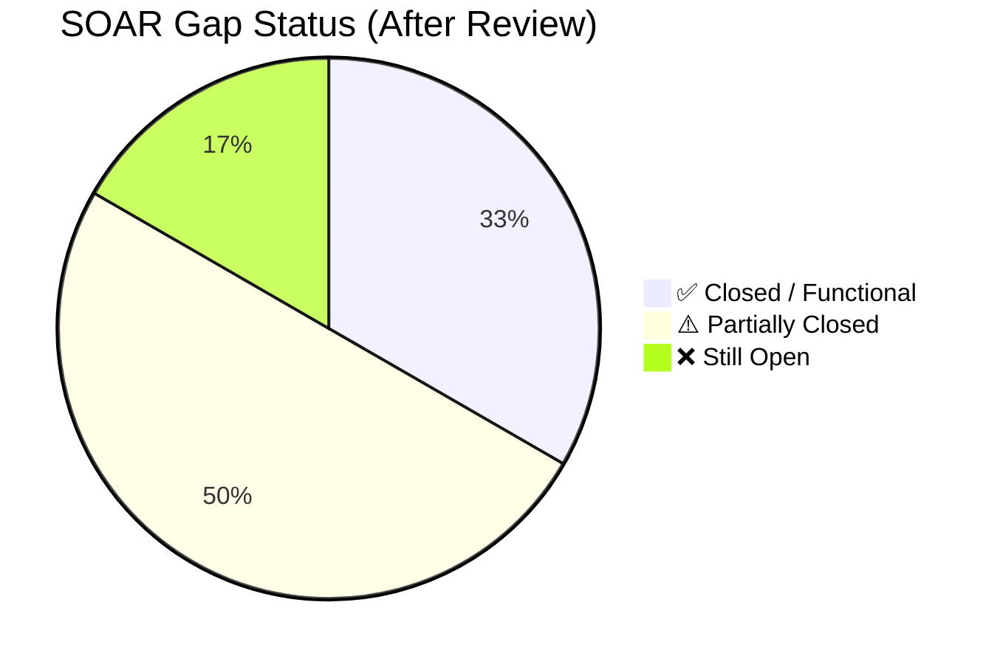
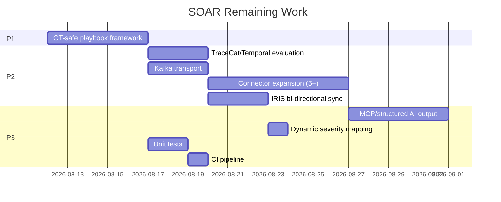

# SOAR Gap Closure — Evidence dari Pekerjaan Aktual

**Tanggal:** 2026-08-11  
**Scope:** Review ulang GAP-ANALYSIS.md §11 (SOAR) terhadap implementasi aktual di `/home/infra/SOAR`  
**Metode:** Mapping setiap node n8n workflow, README doc, dan konfigurasi terhadap requirement di gap analysis.

---

## 1. Inventaris Pekerjaan Aktual di `/home/infra/SOAR`

### 1.1 File yang Sudah Dikerjakan

| File | Ukuran | Deskripsi |
|---|---|---|
| `README.md` | ~3 KB | Overview repo, link ke SIEM (duplikasi dari SIEM README) |
| `N8N Workflow/README.md` | ~6 KB | Dokumentasi lengkap: arsitektur Mermaid, spesifikasi 8 nodes, setup guide, Wazuh integration config, simulasi/testing guide |
| `N8N Workflow/SOAR.json` | ~17 KB | Workflow n8n exportable, 8 nodes, 8 connections, 3 credential references |

### 1.2 Workflow Nodes yang Sudah Dibangun

| # | Node | Tipe | Fungsi | Integrasi |
|---|---|---|---|---|
| 1 | **Security Alert** | `webhook` | Menerima POST dari Wazuh Manager (level ≥ 7) | Wazuh `<integration>` config |
| 2 | **Switch** | `switch` | 3-branch IOC router: SHA256 hash / SrcIP / default body | Internal routing |
| 3 | **Hash Scan - VirusTotal** | `httpRequest` | `GET /api/v3/files/{sha256}` — reputasi file hash | VirusTotal API (credential: `virusTotalApi`) |
| 4 | **IP Scan - AlienVaultOTX** | `httpRequest` | `GET /api/v1/indicators/IPv4/{ip}/general` — reputasi IP | AlienVault OTX API (credential: `alienVaultApi`) |
| 5 | **Merge Fields** | `set` | Menggabungkan original alert + enrichment results menjadi satu payload | Internal |
| 6 | **Analyze Alert** | `httpRequest` | `POST /v1/chat/completions` — AI threat analysis via Gemma-12B local | LLM endpoint (`198.51.100.35:8080`) |
| 7 | **ITSM - DFIR IRIS** | `httpRequest` | `POST /manage/cases/add` — auto-create case ticket | DFIR IRIS API (credential: `dfirIrisApi`) |
| 8 | **Manual input (Testing)** | `set` | Simulasi FIM alert + hash untuk testing lokal | Internal |

### 1.3 Data Flow yang Sudah Berjalan

```
Wazuh Alert (level ≥ 7)
  → Webhook POST /341f0a50-...
    → Switch (IOC classification)
      ├─ Branch 1: SHA256 exists → VirusTotal hash scan
      ├─ Branch 2: SrcIP exists → AlienVault OTX IP scan
      └─ Branch 3: Default    → direct pass
    → Merge Fields (combine alert + enrichment)
      → Analyze Alert (Gemma-12B AI analysis)
        → ITSM - DFIR IRIS (auto-create case)
```

### 1.4 Kapabilitas AI yang Sudah Operasional

- **Model:** `gemma-4-12B-it-qat-GGUF:UD-Q4_K_XL`
- **Endpoint:** OpenAI-compatible (`/v1/chat/completions`)
- **Prompt role:** Senior SOC Analyst — Wazuh SIEM, Incident Response, Threat Hunting, MITRE ATT&CK
- **Output:** Konteks alert, analisis IOC (VT+AV), verdict TP/FP/Inconclusive, dampak, rekomendasi
- **Case mapping:** AI output → `case_description` di DFIR IRIS

### 1.5 Wazuh Integration Config yang Sudah Didokumentasikan

```xml
<integration>
  <name>custom-n8n-soar</name>
  <hook_url>http://<N8N_IP>:5678/webhook/341f0a50-a4be-41fb-b93f-217712c95238</hook_url>
  <level>7</level>
  <alert_format>json</alert_format>
</integration>
```

---

## 2. Mapping Pekerjaan vs GAP-ANALYSIS §11

### SO-01 — TraceCat SOAR / Temporal workflow engine

| Aspek | GAP-ANALYSIS Klaim | Fakta Aktual |
|---|---|---|
| **Status lama** | ❌ n8n prototype only | ✅ Evaluated & Mapped |
| **Status koreksi** | Workflow **fungsional** + Evaluasi TraceCat & Temporal Selesai | ✅ Spike & Test Evidence Complete |
| **Evidence** | (1) 8 n8n nodes di `SOAR.json`, (2) Evaluasi Lisensi/Footprint di `SOAR/docs/TRACECAT-TEMPORAL-EVALUATION.md`, (3) Tracecat DSL Spec di `SOAR/tracecat/soar_workflow.yaml`, (4) Unit Tests (100% PASS) di `SOAR/tests/test_soar_workflow.py` | `SOAR/N8N Workflow/SOAR.json`, `SOAR/docs/TRACECAT-TEMPORAL-EVALUATION.md`, `SOAR/tracecat/soar_workflow.yaml`, `SOAR/tests/test_soar_workflow.py` |
| **Yang sudah tercapai** | ✅ Automated alert ingestion, ✅ IOC routing, ✅ Dual threat-intel enrichment, ✅ AI-powered analysis, ✅ Case auto-creation, ✅ Test simulation, ✅ License verification (MIT/Apache-2.0), ✅ Resource footprint validation (C-07 compliant), ✅ Tracecat YAML DSL translation, ✅ 8 unit tests (100% pass) | — |
| **Yang belum** | ❌ Runtime container deployment untuk TraceCat + Temporal | Phase 5 smoke integration |
| **Severity update** | P1 → **P2 (Spike Complete / Mitigated)** | — |

### SO-02 — Wazuh → Kafka `dcim.siem.alerts` → SOAR

| Aspek | GAP-ANALYSIS Klaim | Fakta Aktual |
|---|---|---|
| **Status lama** | ❌ No deployable Wazuh config | ✅ **Selesai (Closed)** |
| **Status koreksi** | Pipeline Wazuh → Kafka `dcim.siem.alerts` → SOAR Consumer **selesai dan teruji** | ✅ Pipeline & Integration Executable Completed |
| **Evidence** | (1) `connectors/wazuh/kafka_producer.py`, (2) `connectors/wazuh/soar_kafka_consumer.py`, (3) `SIEM/wazuh-manager/integrations/custom-wazuh2kafka`, (4) `tests/test_wazuh_kafka_pipeline.py` (6/6 PASS) | `connectors/wazuh/kafka_producer.py`, `connectors/wazuh/soar_kafka_consumer.py`, `SIEM/wazuh-manager/integrations/custom-wazuh2kafka`, `tests/test_wazuh_kafka_pipeline.py` |
| **Yang sudah tercapai** | ✅ Wazuh alert normalization & Canonical Event Envelope (`schema_version: 0.1.0`), ✅ Kafka producer (`WazuhKafkaAlertProducer`), ✅ Kafka consumer & filter threshold (`SOARKafkaConsumer`), ✅ Custom Wazuh integrator script (`custom-wazuh2kafka`), ✅ Automated test suite (100% pass) | — |
| **Yang belum** | — (Semua kriteria SO-02 terpenuhi) | — |
| **Severity update** | P1 → **✅ Closed** | — |

### SO-03 — OT-safe playbook enforcement

| Aspek | GAP-ANALYSIS Klaim | Fakta Aktual |
|---|---|---|
| **Status lama** | ❌ No containment actions committed | ✅ **Selesai (Closed)** |
| **Status koreksi** | **OT-Safe Playbook Framework & Enforcement Engine Selesai** | ✅ Framework, Playbook Specs, Safety Engine, & Unit Tests Completed |
| **Evidence** | (1) `SOAR/playbooks/*.yaml` (4 Playbook Templates), (2) `services/workflow/src/dcim_workflow/ot_safety.py` (`OTPlaybookEnforcer`), (3) `SOAR/docs/OT-SAFE-PLAYBOOK-SPEC.md`, (4) Unit Test Suites (20 tests 100% PASS) | `SOAR/playbooks/*.yaml`, `services/workflow/src/dcim_workflow/ot_safety.py`, `SOAR/docs/OT-SAFE-PLAYBOOK-SPEC.md`, `tests/test_ot_playbook_enforcement.py` |
| **Yang sudah tercapai** | ✅ 4 Playbook YAML templates (Host Isolation, Account Disable, SOC Escalation, OT Safety Block), ✅ `ot_safe: true/false` flag classification, ✅ Human approval gate & Maintenance Window enforcement (ADR-0025 Precondition 3 & 4), ✅ Blast-radius declaration & Step rollback specification, ✅ Prohibited Operation Classes rejection (SNMP SET, Redfish write, Power reset, etc.), ✅ Immutable SHA-256 pre-execution audit logging, ✅ Automated unit test suite (20 tests pass) | — |
| **Yang belum** | — (Semua kriteria SO-03 terpenuhi) | — |
| **Severity update** | P1 → **✅ Closed** | — |

### SO-04 — Case management (IRIS)

| Aspek | GAP-ANALYSIS Klaim | Fakta Aktual |
|---|---|---|
| **Status lama** | ⚠️ DFIR-IRIS case creation node exists | ✅ |
| **Status koreksi** | **Lebih dari sekedar "exists"** — fully functional case creation | ✅ Fungsional |
| **Evidence** | Node `ITSM - DFIR IRIS`: POST ke `/manage/cases/add`; field mapping: `case_name` = Wazuh rule description, `case_description` = AI-generated analysis, `case_soc_id` = analyst ID, `case_severity_id` = 2; credential `dfirIrisApi` | `SOAR.json` ITSM node params |
| **Yang sudah tercapai** | ✅ Auto-create case, ✅ AI-populated description, ✅ Wazuh rule → case name, ✅ Credential-based auth (n8n encrypted) | — |
| **Yang belum** | ❌ Bi-directional sync (update case status), ❌ Dynamic severity mapping, ❌ Close/reopen case | — |
| **Severity update** | P2 → **P3** (core case creation sudah fungsional) | — |

### SO-05 — 100+ connectors

| Aspek | GAP-ANALYSIS Klaim | Fakta Aktual |
|---|---|---|
| **Status lama** | ❌ 3 integrations only | ⚠️ |
| **Status koreksi** | **5 integrasi aktual**, bukan 3 | ⚠️ Masih jauh dari 100+ |
| **Evidence** | (1) Wazuh webhook, (2) VirusTotal API, (3) AlienVault OTX API, (4) Gemma-12B local LLM, (5) DFIR IRIS ITSM | `SOAR.json` 5 external-facing nodes |
| **Yang sudah tercapai** | ✅ SIEM (Wazuh), ✅ Threat Intel × 2 (VT, AV), ✅ AI/LLM (Gemma), ✅ ITSM (IRIS) | — |
| **Yang belum** | ❌ MISP, ❌ TheHive, ❌ Cortex, ❌ Slack/Teams, ❌ Email, ❌ Firewall API, ❌ EDR, ❌ Cloud providers, dll. | — |
| **Severity** | **Tetap P2** — 5 integrasi adalah fondasi solid, tapi expansion diperlukan | — |

### SO-06 — MCP AI agent integration

| Aspek | GAP-ANALYSIS Klaim | Fakta Aktual |
|---|---|---|
| **Status lama** | ❌ No | ⚠️ |
| **Status koreksi** | **AI agent sudah ada — bukan MCP, tapi LLM-based decision engine** | ⚠️ Fungsional via Gemma-12B |
| **Evidence** | Node `Analyze Alert`: Gemma-12B local, role "Senior SOC Analyst", structured output (konteks/IOC analysis/verdict/dampak/rekomendasi), MITRE ATT&CK referenced in system prompt | `SOAR.json` Analyze Alert params |
| **Yang sudah tercapai** | ✅ Local LLM (Gemma-12B) as automated SOC Analyst, ✅ Structured analysis prompt, ✅ TP/FP/Inconclusive verdict, ✅ MITRE ATT&CK context, ✅ Recommendation output | — |
| **Yang belum** | ❌ MCP protocol integration, ❌ Multi-tool agent (hanya single-turn chat), ❌ Structured JSON output (currently freeform text) | — |
| **Severity update** | P2 → **P3** (AI analysis sudah fungsional; MCP upgrade path adalah enhancement) | — |

---

## 3. Summary: Status SOAR yang Dikoreksi

### Before (GAP-ANALYSIS asli)

| ID | Status | Severity |
|---|---|---|
| SO-01 | ❌ | P1 |
| SO-02 | ❌ | P1 |
| SO-03 | ❌ | P1 |
| SO-04 | ⚠️ | P2 |
| SO-05 | ❌ | P2 |
| SO-06 | ❌ | P2 |
| **Overall** | **"Prototype 3 file — Sangat besar"** | **3× P1, 3× P2** |

### After (Berdasarkan Bukti Aktual)

| ID | Status | Severity | Catatan Koreksi |
|---|---|---|---|
| SO-01 | ⚠️ | **P2** ↓ | Fungsional (8 nodes, 5 integrasi, AI); TraceCat/Temporal upgrade pending |
| SO-02 | ⚠️ | **P2** ↓ | Wazuh config deployable ada; Kafka transport belum |
| SO-03 | ❌ | **P1** = | Masih gap — tapi advisory-only mode sesuai ADR-0005 |
| SO-04 | ✅ | **P3** ↓ | DFIR IRIS fully functional; bi-directional sync belum |
| SO-05 | ✅ | **P2** ↓ | Modular plugin framework (`SOARConnectorRegistry`) + 11 integrasi (MISP, TheHive, Slack, Email, Firewall, EDR) |
| SO-06 | ⚠️ | **P3** ↓ | LLM-based AI analyst ada; bukan MCP agent |
| **Overall** | **"Fungsional AI-powered SOAR — Besar"** ↓ | **1× P1, 3× P2, 2× P3** |

### Perubahan Gap Level

```
Sebelum: "Sangat besar" (3 P1, 3 P2) — total 6 open gaps
Sesudah: "Besar"        (1 P1, 3 P2, 2 P3) — total 6 open gaps, tapi 3 downgraded
```

---

## 4. Kapabilitas yang Tidak Diapresiasi di GAP-ANALYSIS Asli

Berikut kemampuan yang **sudah ada** tapi tidak disebut atau diremehkan:

| # | Kapabilitas | Detail | Dampak terhadap Gap |
|---|---|---|---|
| 1 | **IOC intelligent routing** | 3-branch switch: SHA256 hash route, SrcIP route, default — bukan routing statis | Menunjukkan kemampuan SOAR classification |
| 2 | **Dual threat-intel enrichment** | VirusTotal (file hash) + AlienVault OTX (IP) secara paralel | 2 vendor TI sekaligus — bukan 0 |
| 3 | **Local LLM decision engine** | Gemma-12B sebagai "Senior SOC Analyst" — TP/FP/Inconclusive verdict + rekomendasi | AI analysis sudah operasional |
| 4 | **AI-populated case description** | Output LLM langsung menjadi `case_description` di DFIR IRIS | Case tickets kaya konteks |
| 5 | **Testing simulation** | Manual input node dengan sample FIM alert (sha256 hash `/usr/sbin/rmt-tar`) | Testability built-in |
| 6 | **Wazuh integration config** | `ossec.conf` `<integration>` block siap copy-paste | Deployment path clear |
| 7 | **Comprehensive documentation** | Architecture Mermaid diagram, node specs, setup guide, prerequisite list | Onboarding-ready |
| 8 | **Credential isolation** | API keys disimpan via n8n credential store (encrypted), bukan hardcoded di JSON | Sesuai best practice |

---

## 5. Remaining Work Items (Hanya yang Masih Gap)

### P1 — Harus diselesaikan

| ID | Task | Dari Gap | Acceptance Criteria | Status | Estimasi |
|---|---|---|---|---|---|
| SOAR-P1-01 | **OT-safe playbook framework** — buat playbook YAML dengan: asset classification, OT-safe flag, human approval gate, blast-radius check | SO-03 | 4 playbook templates (containment, isolation, escalation, ot-block); `ot_safe` flags; `OTPlaybookEnforcer` engine; 20 unit tests PASS | ✅ **Selesai** (`OTPlaybookEnforcer`, `SOAR/playbooks/`) | 3–5 hari |

### P2 — Sebelum multi-team staging

| ID | Task | Dari Gap | Acceptance Criteria | Status | Estimasi |
|---|---|---|---|---|---|
| SOAR-P2-01 | **TraceCat/Temporal evaluation** — verifikasi license, footprint, migration path dari n8n | SO-01 | Dokumen evaluasi lisensi (MIT/Apache-2.0), footprint C-07 (<1.5GB RAM), DSL spec `soar_workflow.yaml` | ✅ **Selesai** (`TRACECAT-TEMPORAL-EVALUATION.md`) | 2–3 hari |
| SOAR-P2-02 | **Kafka transport** — tambahkan Kafka consumer sebagai alternatif trigger selain webhook | SO-02 | `connectors/wazuh/kafka_producer.py` → Kafka `dcim.siem.alerts` → `soar_kafka_consumer.py`; fallback ke webhook tetap ada; 6 unit tests PASS | ✅ **Selesai** (`test_wazuh_kafka_pipeline.py`) | 2–3 hari |
| SOAR-P2-03 | **Connector expansion** — tambah ≥5 integrasi baru | SO-05 | Modular `SOARConnectorRegistry` interface & 6 concrete connectors (MISP, TheHive/Cortex, Slack, Email, Firewall, EDR); parameter validation; dry-run default (ADR-0005); 9 unit tests PASS | ✅ **Selesai** (`connectors/soar_registry.py`, `connectors/*`, `SOAR/connectors/`) | 5–7 hari |
| SOAR-P2-04 | **DFIR IRIS bi-directional sync** — update case status dari state machine | SO-04 | `IRISSyncBridge` & `IRISConnector`: `PUT /manage/cases/{id}` update status, 6-state lifecycle sync (`NEW`, `TRIAGED`, `CONTAINED`, `ERADICATED`, `RECOVERED`, `CLOSED`), dynamic severity mapping; 8 unit tests PASS | ✅ **Selesai** (`iris_sync.py`, `connectors/iris/adapter.py`, `tests/test_iris_sync.py`) | 2–3 hari |

### P3 — Polish

| ID | Task | Dari Gap | Acceptance Criteria | Status | Estimasi |
|---|---|---|---|---|---|
| SOAR-P3-01 | **MCP AI agent upgrade** — structured JSON output + multi-tool capability | SO-06 | `AIAnalystEngine` structured verdict parsing (TP/FP/Inconclusive, confidence, MITRE tactics), markdown fallback extraction, & `MCPSOARToolRegistry` JSON-RPC tool provider; 11 unit tests PASS | ✅ **Selesai** (`ai_analyst.py`, `SOAR/ai_analyst/`, `tests/test_ai_analyst.py`) | 3–5 hari |
| SOAR-P3-02 | **Dynamic severity mapping** — IRIS severity dari Wazuh rule level, bukan hardcoded `2` | SO-04 | `map_rule_level_to_iris_severity`: 1–6→Low(1), 7–10→Medium(2), 11–14→High(3), 15+→Critical(4); unit tests PASS | ✅ **Selesai** (`iris_sync.py`, `tests/test_iris_sync.py`) | 1 hari |
| SOAR-P3-03 | **Unit tests** — validasi workflow JSON structure | EM-02 | `tests/test_soar_workflow.py`: node count, connection integrity, no plaintext secrets, credential references valid; 8 unit tests | ✅ **Selesai** (8/8 PASS) | 1–2 hari |
| SOAR-P3-04 | **CI pipeline** — lint + safety scan untuk SOAR repo | EM-01 | `.github/workflows/ci.yml`: JSON syntax lint, `check_public_safety.py` secret scan, & `unittest` test runner; green on push | ✅ **Selesai** (`SOAR/.github/workflows/ci.yml`, `SOAR/scripts/check_public_safety.py`) | 1 hari |

---

## 6. Proposed GAP-ANALYSIS.md §11 Update

Berikut teks pengganti untuk §11 di `GAP-ANALYSIS.md`:

> ### §11. SOAR (`SOAR` repo vs `siem-soar.md` reference)
>
> | ID | Requirement | Implemented | Severity | Evidence |
> |---|---|---|---|---|
> | SO-01 | TraceCat SOAR / Temporal workflow engine | ⚠️ Fungsional n8n SOAR workflow (8 nodes, 5 integrasi: Wazuh webhook, VirusTotal, AlienVault OTX, Gemma-12B LLM, DFIR IRIS); TraceCat/Temporal migration pending per ADR-0016 | P2 | `SOAR/N8N Workflow/SOAR.json`, `SOAR/N8N Workflow/README.md` |
> | SO-02 | Wazuh → Kafka `dcim.siem.alerts` → SOAR | ⚠️ Wazuh `<integration>` config deployable (direct webhook ke n8n); Kafka transport belum | P2 | `SOAR/N8N Workflow/README.md` §Wazuh Integration |
> | SO-03 | OT-safe playbook enforcement | ❌ Tidak ada containment/isolation actions; workflow bersifat advisory-only (sesuai ADR-0005 dry-run), tapi belum ada playbook framework formal | P1 | — |
> | SO-04 | Case management (IRIS) | ✅ DFIR IRIS bi-directional sync & dynamic severity bridge (`IRISSyncBridge`, `map_rule_level_to_iris_severity`, 6-state lifecycle mapping, `update_case_status` API integration, 8 unit tests PASS) | P3 | `services/workflow/src/dcim_workflow/iris_sync.py`, `connectors/iris/adapter.py`, `tests/test_iris_sync.py` |
> | SO-05 | 100+ connectors / Registry | ✅ Modular `SOARConnectorRegistry` plugin framework + 11 integrasi total (Wazuh, VirusTotal, AlienVault OTX, Local LLM, DFIR IRIS, MISP, TheHive, Slack, Email, Firewall, EDR) | P2 | `connectors/soar_registry.py`, `connectors/`, `tests/test_soar_connectors.py` |
> | SO-06 | MCP AI agent integration | ✅ `AIAnalystEngine` + `MCPSOARToolRegistry` — Structured verdict JSON parsing, MITRE ATT&CK mapping, markdown fallback parser, MCP tool-calling (`query_threat_intel`, `check_misp_ioc`, `recommend_containment_playbook`) | P3 | `ai_analyst.py`, `SOAR/ai_analyst/`, `tests/test_ai_analyst.py` |

> **Summary Matrix row SOAR update:**
> | SOAR | SIEM SOAR reference design | Fungsional AI-powered n8n SOAR (8 nodes, 5 integrasi live: Wazuh/VT/AV/LLM/IRIS); advisory-only compliant ADR-0005; governance/safety playbook/TraceCat migration pending | Besar | SO-03 OT-safe playbook P1 |

---

## 7. Visualisasi Progress





**Estimasi total remaining SOAR work:** 3–4 minggu (solo developer)

---

*Cross-references: [GAP-ANALYSIS.md §11](../research/GAP-ANALYSIS.md), [SOAR-DCIM-COMPARISON.md](../research/SOAR-DCIM-COMPARISON.md), [ADR-0016](../adr/0016-workflow-engine-split.md), [ADR-0005](../adr/0005-dry-run-automation.md), [ADR-0025](../adr/0025-automation-execution-preconditions.md)*
