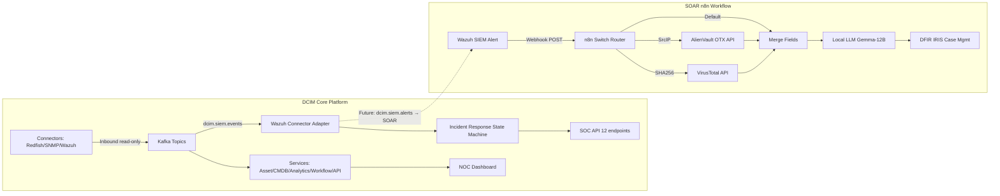
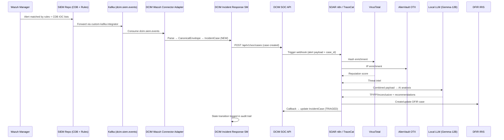

# Komparasi & Korelasi: DCIM Core Platform ↔ SOAR (n8n Workflow)

**Tanggal:** 2026-08-11  
**Scope:** Perbandingan arsitektur, fitur, data flow, dan integration point antara `/home/infra/dcim-core-platform` dan `/home/infra/SOAR`.

---

## 1. Profil Masing-Masing

| Aspek | DCIM Core Platform | SOAR (n8n Workflow) |
|---|---|---|
| **Repo Path** | `/home/infra/dcim-core-platform` | `/home/infra/SOAR` |
| **Tujuan** | Platform DCIM: ingestion, Asset/CMDB, Analytics, Workflow, SIEM boundary, NOC Dashboard | AI-Powered Security Orchestration, Automation & Response |
| **Maturity** | Alpha/Prototype — Phase 0–3 DEV-APPROVED (bounded) | Prototype — single n8n workflow JSON export |
| **Tech Stack** | Python 3.12, FastAPI, Pydantic v2, Kafka, PostgreSQL, Compose, TraceCat/Temporal (planned) | n8n (low-code), Wazuh webhook, VirusTotal API, AlienVault OTX API, Gemma-12B LLM (local), DFIR IRIS |
| **File Count** | ~200+ files (services, tests, docs, schemas, connectors, scripts) | 3 files (`README.md`, `N8N Workflow/README.md`, `N8N Workflow/SOAR.json`) |
| **Tests** | 205+ unit/integration tests | 0 tests |
| **CI/CD** | GitHub Actions synthetic CI | Tidak ada |
| **Governance** | ADR-based (29+ decisions), Project Charter, Security Policy, Threat Model | Tidak ada governance docs |
| **License** | Apache-2.0 | Tidak terdefinisi |

---

## 2. Perbandingan Arsitektur

### 2.1 Data Flow

### 2.2 Perbedaan Paradigma

| Dimensi | DCIM Core Platform | SOAR |
|---|---|---|
| **Arsitektur** | Microservices (event-driven, Kafka, REST API) | Single workflow (webhook-driven, sequential pipeline) |
| **Event Transport** | Kafka topics (`dcim.siem.events`, `dcim.raw.*`, `dcim.analytics.metrics`) | HTTP Webhook POST langsung dari Wazuh |
| **Keamanan** | Read-only connectors (ADR-0004), dry-run default (ADR-0005), 5 safety preconditions (ADR-0025) | Tidak ada safety guard, langsung auto-create case |
| **State Management** | 6-state incident lifecycle (NIST SP 800-61), append-only audit log | Stateless — satu webhook = satu case ticket |
| **AI/ML** | Planned: TraceCat + Temporal (ADR-0016), LLM/RAG endpoint (stub) | Implemented: Local Gemma-12B via OpenAI-compatible API |
| **Case Management** | `IncidentCase` dataclass + `iris_ticket_id` field (code) | DFIR IRIS HTTP API integration (live) |
| **Threat Intel** | CDB lists 451K IOCs di Wazuh (via SIEM repo) | VirusTotal API + AlienVault OTX API (live enrichment) |

---

## 3. Tabel Korelasi Fitur

| Domain | DCIM Core Platform Component | SOAR Component | Korelasi | Gap |
|---|---|---|---|---|
| **Alert Ingestion** | `connectors/wazuh/adapter.py` — `WazuhFixtureAdapter` replay synthetic fixtures | `Security Alert` webhook node — menerima POST dari Wazuh real-time | DCIM punya adapter untuk parsing event Wazuh; SOAR punya live webhook trigger. Keduanya consume Wazuh alert, beda transport. | DCIM: hanya fixture replay, belum live. SOAR: live tapi tanpa Kafka. |
| **IOC Routing** | Tidak ada routing logic di connector; event diteruskan apa adanya | `Switch` node — routing berdasarkan SHA256 hash vs SrcIP vs default | SOAR lebih maju di IOC routing/classification | DCIM belum punya IOC classifier |
| **Threat Intel Enrichment** | SIEM repo: 451K CDB lists (offline, rule-based matching di Wazuh) | VirusTotal + AlienVault OTX API (online, real-time query) | Komplementer: DCIM/SIEM punya offline IOC database, SOAR punya online enrichment | Perlu bridge: alert masuk → offline CDB check → online API enrichment |
| **AI Analysis** | `services/analytics/` (stub 501); LLM/RAG endpoint planned (ADR-0027, Phase 4) | `Analyze Alert` node — Gemma-12B local LLM sebagai "Senior SOC Analyst" | SOAR sudah operasional dengan LLM; DCIM masih stub | DCIM bisa adopt pattern yang sama: local LLM + structured prompt |
| **Incident State Machine** | `incident_response.py` — 6-state NIST lifecycle (NEW→TRIAGED→CONTAINED→ERADICATED→RECOVERED→CLOSED) | Tidak ada state machine; linear: Alert → Enrich → Analyze → Create Case | DCIM lebih mature di lifecycle tracking | SOAR perlu state machine untuk track case lifecycle |
| **Case Management** | `IncidentCase` dataclass dengan `iris_ticket_id` field; belum ada HTTP call ke IRIS | `ITSM - DFIR IRIS` node — HTTP POST create case di DFIR IRIS | Keduanya target DFIR IRIS; DCIM punya model, SOAR punya live integration | Perlu connect: DCIM create `IncidentCase` → trigger SOAR → create IRIS ticket |
| **SOC API** | 12 REST endpoints (Alert Triage, Case Lifecycle, Threat Intel, Rules, Metrics, Dry-Run) | Tidak ada API; hanya internal workflow | DCIM punya API layer yang bisa expose SOAR results | SOAR perlu publish results ke SOC API |
| **Safety Controls** | ADR-0004 (read-only), ADR-0005 (dry-run), ADR-0025 (5 preconditions), kill switch | Tidak ada safety controls | DCIM jauh lebih mature di safety | SOAR auto-execute tanpa approval — risiko tinggi |
| **Workflow Engine** | ADR-0016: TraceCat (SOAR) + Temporal (durable) + n8n (operational) | n8n single workflow | DCIM sudah tentukan n8n untuk operational, TraceCat untuk SOAR | SOAR workflow harus migrasi ke TraceCat per ADR-0016 |
| **Audit Trail** | Append-only `IncidentStateHistory` per case | Tidak ada audit trail | DCIM punya audit; SOAR tidak | SOAR perlu emit audit events ke DCIM |
| **MITRE ATT&CK** | SIEM repo: 20 custom detection rules (SSH brute force, SQLi, XSS, FIM, dll) | LLM prompt mentions MITRE ATT&CK, tapi hanya di prompt text — tidak structured | DCIM punya rule-based detection; SOAR punya AI-based analysis | Bisa combine: rule-based detection trigger → AI enrichment & verdict |

---

## 4. Integration Architecture (Korelasi Data Flow)

Berikut pemetaan bagaimana kedua sistem seharusnya terintegrasi:

---

## 5. Gap Summary (Untuk Integrasi)

| # | Gap | Owner | Severity | Solusi |
|---|---|---|---|---|
| 1 | DCIM Wazuh connector hanya replay fixture, belum consume live Kafka | DCIM | P1 | Implement live Kafka consumer di `connectors/wazuh/` |
| 2 | SOAR menerima webhook langsung dari Wazuh, bypass DCIM pipeline | SOAR | P1 | Ubah trigger: SOC API → SOAR (bukan Wazuh langsung) |
| 3 | SOAR tidak punya safety controls (dry-run, approval, kill switch) | SOAR | P1 | Apply ADR-0005/ADR-0025 controls ke SOAR workflow |
| 4 | SOAR auto-create IRIS case tanpa state machine check | SOAR | P2 | Integrate dengan `IncidentCase` state machine sebelum create |
| 5 | DCIM LLM/RAG endpoint masih stub 501 | DCIM | P2 | Adopt SOAR's Gemma-12B pattern di `services/analytics/` |
| 6 | Tidak ada feedback loop SOAR → DCIM | Both | P2 | SOAR emit result ke Kafka `dcim.soar.results` → SOC API callback |
| 7 | SOAR tetap di n8n, tapi ADR-0016 menentukan TraceCat untuk SOAR | SOAR | P2 | Migrasi SOAR workflow ke TraceCat + Temporal |
| 8 | Tidak ada shared event schema antara DCIM dan SOAR | Both | P2 | Extend `schemas/event-envelope.schema.json` untuk SOAR events |
| 9 | SOAR tidak punya test atau CI | SOAR | P2 | Tambah tests + CI pipeline, integrate dengan DCIM `make phase0-check` |
| 10 | Threat intel enrichment terfragmentasi (offline CDB vs online API) | Both | P3 | Unified threat intel pipeline: CDB pre-filter → API on-demand |

---

## 6. Kesimpulan

### Komparasi
- **DCIM Core Platform** adalah sistem **enterprise-grade** dengan governance ketat (29 ADR), safety controls berlapis, microservices architecture, dan 205+ tests — tetapi banyak komponen masih scaffold/stub.
- **SOAR** adalah **prototype fungsional** yang sudah menjalankan AI-powered incident response secara end-to-end (Wazuh → enrichment → LLM → IRIS) — tetapi tanpa governance, safety, state management, atau tests.

### Korelasi
Kedua sistem **sangat komplementer**:
1. **DCIM menyediakan fondasi** yang SOAR butuhkan: event schema, safety controls, incident state machine, audit trail, SOC API, dan governance framework.
2. **SOAR menyediakan implementasi live** yang DCIM belum punya: real-time threat enrichment (VirusTotal/AlienVault), AI-powered analysis (Gemma-12B), dan DFIR IRIS case creation.
3. **Target integrasi**: SOAR harus menjadi **downstream consumer** dari DCIM SOC API (bukan langsung dari Wazuh), mematuhi DCIM safety controls, dan mengembalikan hasilnya ke DCIM incident state machine.
4. **Per ADR-0016**, SOAR workflow harus dimigrasi dari n8n ke **TraceCat + Temporal** untuk durability dan security boundary compliance.

---

*Cross-reference: [GAP-ANALYSIS.md](GAP-ANALYSIS.md) §7 (SIEM/SOC), §11 (SOAR), [ADR-0016](../adr/0016-workflow-engine-split.md), [ADR-0029](../adr/0029-wazuh-siem-connector-boundary.md).*
